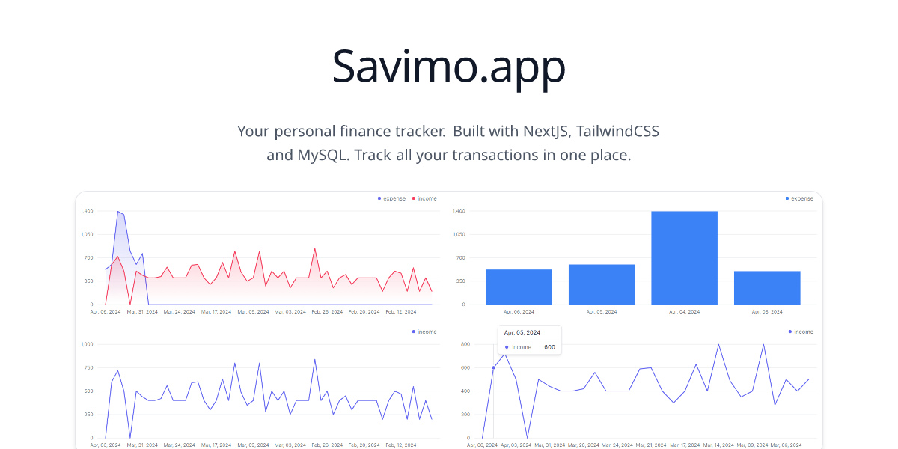

# savimo.app

A full stack expense tracker app built with NextJS, Next-auth, Tailwind CSS, and MySQL database.

## Features

-   User authentication with Next-auth
-   Charts for dashboard to show analytics using tremor-ui
-   Add, edit, delete payment-methods
-   Add, edit, delete categories
-   Add, edit, delete transactions
-   Add custom charts ui to view the dashboard
-   Add, edit, delete budgets
-   Filters to view transactions by date, category, payment-method
-   Calendar view to view transactions by date
-   Responsive design
-   Dark mode

Tech stack:

-   NextJS
-   Next-auth
-   Tailwind CSS
-   Tremor UI
-   Shadcn UI
-   Typescript
-   Prisma ORM
-   MySQL Database
-   react-hook-form
-   @tanstack/react-query
-   @tanstack/react-table
-   sonner for toast notifications
-   zod for schema validation
-   date-fns for date manipulation and formatting

Preview:

